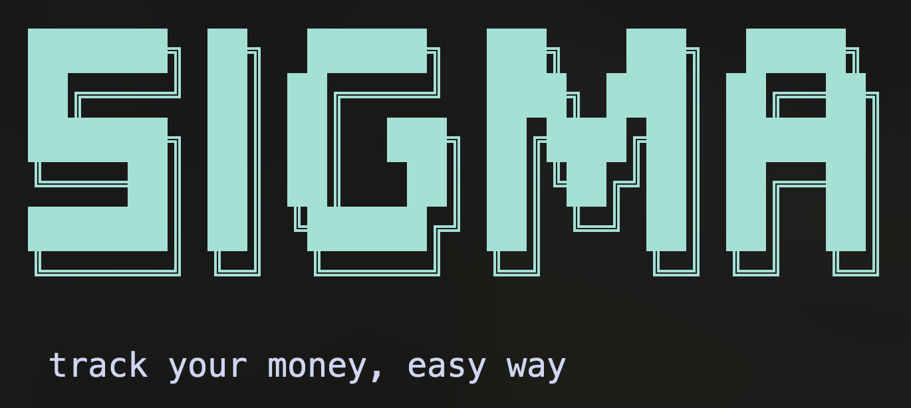

# Sigma (`sgm`)

[](https://pypi.org/project/sigma-finance/)
[](LICENSE)

**Sigma** is a fast, CLI-first personal finance tracker designed for local use. It focuses on rapid transaction logging, simple account management, and auditable snapshots through a unique "rendering" cycle.



## Why Sigma?

Most finance trackers are either too complex or require too many clicks. Sigma is built for users who live in the terminal and want to:

*   **Log quickly**: Record expenses, income, and transfers with minimal keystrokes.
*   **Audit with ease**: Use the `render` command to verify and clear your pending movements into historical snapshots.
*   **Stay local**: Your data stays on your machine in a lightweight SQLite database.
*   **See the big picture**: Rich terminal tables provide instant clarity on your balances and credit availability.

## Features

- ⚡ **Fast Logging**: Simple commands for `exp` (expense), `inc` (income), and `tr` (transfer).
- 🏦 **Account Management**: Support for both **Debit** and **Credit** accounts with rolling credit limit tracking.
- 🔄 **Rendering Cycle**: Mark movements for review and "render" them into your history once verified.
- 📊 **Rich Interface**: Beautifully formatted tables powered by [Rich](https://github.com/Textualize/rich).
- 📜 **Audit Log**: Full history of movements and render snapshots.
- 🤖 **Telegram Bot**: Optional integration to securely interact with Sigma via Telegram using standard CLI commands.

## Installation

Sigma requires **Python 3.10** or higher.

```bash
# Core CLI only
pip install sigma-finance

# With Telegram Bot integration
pip install "sigma-finance[telegram]"
```

### First-run Setup

Once installed, initialize your database and create your first account:

```bash
sgm start
```

## Usage

### Core Workflow

1.  **Check your status**:
    ```bash
    sgm status
    ```
2.  **Log an expense**:
    ```bash
    # Usage: sgm exp <amount> <description> <mark_for_render: yes|no> [account_id] [date]
    sgm exp 5000 "Lunch" yes wallet 2026-05-20
    ```
3.  **Log income**:
    ```bash
    sgm inc 2500000 "Salary" no bci
    ```
4.  **Transfer between accounts**:
    ```bash
    sgm tr bci wallet 50000
    ```
5.  **Render marked movements**:
    ```bash
    # Sums marked items, logs to history, and clears marks.
    sgm render
    ```

### Telegram Bot

To run Sigma as a background bot, configure your credentials and launch the daemon:

```bash
sgm bot setup   # Configure bot token and allowed users
sgm bot run     # Launch the daemon
```

*For Docker, systemd, or launchd setup details, see the [Telegram Bot Deployment Guide](docs/plans/telegram-deployment.md).*

### Command Reference

| Command | Description |
| :--- | :--- |
| `sgm status` | Show balances, credit limits, and marked totals. |
| `sgm log [limit]` | List recent movements (default: 15). |
| `sgm history` | View previous render results. |
| `sgm acc list` | List all accounts and their details. |
| `sgm config` | Configure default accounts for faster logging. |
| `sgm export` | Export all data to a ZIP file with CSV tables. |
| `sgm delete <id>` | Remove a record by its unique ID (e.g., `m-1`). |
| `sgm bot setup` | Configure the Telegram Bot credentials. |
| `sgm bot run` | Start the Telegram Bot event loop. |

For a complete reference of all available commands and their arguments, please refer to the [Detailed CLI Usage Guide](docs/cli-usage.md).

## Development

We use `Makefile` for common development tasks.

```bash
# Clone the repository
git clone https://github.com/fzunigam/sigma
cd sigma

# Install in editable mode with dev dependencies
make install

# Run tests
make test

# Run linter
make lint
```

## Project Structure

- `src/sgm/`: Core package logic.
  - `cli.py`: Typer-based CLI definition.
  - `infrastructure/`: Database (SQLite) and config management.
  - `interface/`: Terminal banners and UI elements.
- `docs/`: Detailed documentation and architecture plans.
- `tests/`: Smoke tests for CLI flows.

## License

Sigma is licensed under the [MIT License](LICENSE).

## Acknowledgments

- [Typer](https://typer.tiangolo.com/) for the CLI framework.
- [Rich](https://github.com/Textualize/rich) for the beautiful terminal output.
