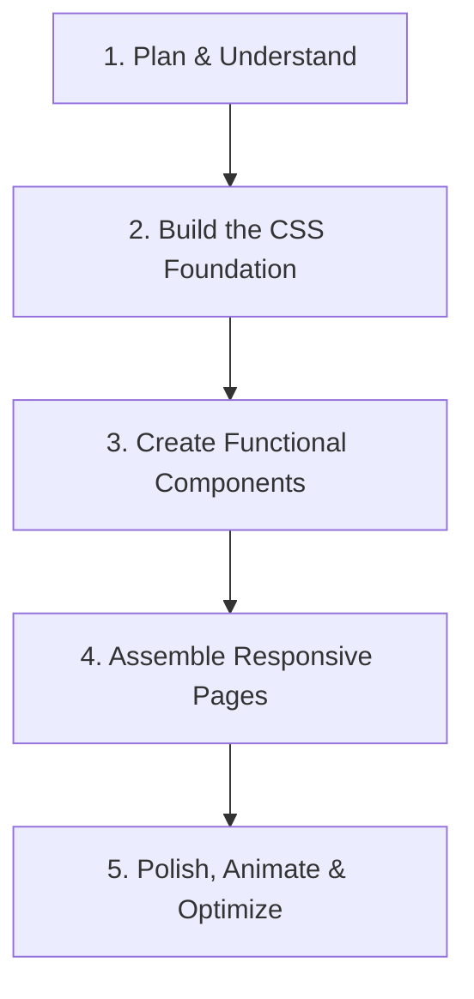

# Web Design Guidelines

This document establishes the web design system, brand aesthetics, tech stack constraints, and development workflow for **Sigma**. If any web or user interface components are introduced, modified, or extended, these guidelines must be strictly followed.

---

## 1. Core Brand Identity & Vibe

Sigma is a CLI-first personal finance tracker focused on fast logging and auditable render snapshots. Its web interface must blend the **speed, structure, and data density of a command-line interface** with the **premium, tactile, and immersive experience of a modern web application**.

### Visual Pillars
- **Sleek Dark Theme**: By default, Sigma utilizes a premium deep-slate/obsidian dark mode. No harsh pure-blacks, but rich, dark HSL-defined spaces.
- **Monospace Precision**: JetBrains Mono or similar monospace fonts are used for all numbers, balances, financial logs, dates, and CLI/data structures.
- **Tactile UI Controls**: Borders, clean divider lines, and high-contrast indicators that make the app feel structured and reliable.
- **Micro-Animations & Vibrancy**: UI elements should feel responsive and alive. Smooth hover states, subtle gradient borders, and soft glassmorphism are encouraged to create a premium feel.

---

## 2. Design System Tokens (CSS Custom Properties)

All styling should be built upon CSS custom variables defined at the `:root` level. Avoid hardcoded values in components.

```css
:root {
  /* Colors - Base */
  --color-bg-base: hsl(220, 15%, 8%);        /* Deep Obsidian */
  --color-bg-surface: hsl(220, 12%, 12%);    /* Charcoal Surface */
  --color-bg-elevated: hsl(220, 12%, 18%);   /* Medium Charcoal */
  
  /* Borders & Dividers */
  --color-border: hsl(220, 10%, 20%);        /* Subtle default border */
  --color-border-hover: hsl(220, 10%, 30%);  /* Hover state borders */
  --color-border-active: hsl(220, 10%, 42%); /* Active/Focus state borders */

  /* Text Colors */
  --color-text-primary: hsl(220, 10%, 96%);  /* Off-white */
  --color-text-secondary: hsl(220, 8%, 68%); /* Muted slate grey */
  --color-text-muted: hsl(220, 8%, 45%);     /* Low-contrast details */

  /* Accents & States */
  --color-accent: hsl(195, 90%, 50%);        /* Electric Cyan */
  --color-accent-hover: hsl(195, 90%, 60%);
  --color-accent-gradient: linear-gradient(135deg, hsl(195, 90%, 50%), hsl(260, 85%, 60%));
  
  --color-success: hsl(142, 70%, 45%);       /* Emerald Green (Income, Positive) */
  --color-danger: hsl(354, 75%, 55%);        /* Rose Red (Expense, Negative) */
  --color-warning: hsl(40, 80%, 55%);         /* Amber (Pending, Unmarked) */

  /* Typography */
  --font-sans: 'Outfit', 'Inter', system-ui, -apple-system, sans-serif;
  --font-mono: 'JetBrains Mono', 'Fira Code', monospace;

  /* Spacing System */
  --spacing-xs: 0.25rem;
  --spacing-sm: 0.5rem;
  --spacing-md: 1rem;
  --spacing-lg: 1.5rem;
  --spacing-xl: 2rem;

  /* Border Radii */
  --radius-sm: 4px;
  --radius-md: 8px;
  --radius-lg: 12px;

  /* Transitions */
  --transition-fast: 0.15s cubic-bezier(0.4, 0, 0.2, 1);
  --transition-normal: 0.25s cubic-bezier(0.4, 0, 0.2, 1);
}
```

---

## 3. Technology Stack Constraints

- **Core**: Standard HTML for structure, Vanilla JavaScript (ES6+) for logic.
- **Styling**: **Vanilla CSS** is preferred for maximum flexibility, performance, and alignment with our custom tokens. **Avoid TailwindCSS** unless explicitly requested by the user. If requested, always confirm the version.
- **Frameworks**: Only introduce frameworks like Next.js or Vite if the user explicitly requests a complex web application.
- **New Project Scaffold**: If creating a new app using a framework, follow these command execution rules:
  - Run the scaffold command with the `--help` flag first (e.g., `npx -y create-vite-app@latest --help`).
  - Use `npx -y` to auto-install dependencies.
  - Initialize the app in the current directory (`./`).
  - Run in non-interactive mode.
- **Running & Validation**: Run the local development server using `npm run dev`. Do not build production packages unless explicitly requested or during final correctness validation.

---

## 4. Visual Excellence & UX Polish

- **Typography**: Import modern fonts (like Google Fonts `Outfit` or `JetBrains Mono`) to replace default system styling.
- **Balances & Monospace**: All monetary balances (CLP pesos), transaction logs, timestamps, and data IDs must be formatted with `--font-mono` to ensure perfect column alignment and precision.
- **Glassmorphism**: Use translucent surfaces with backdrop blurring for floating menus, dialogs, or top navigation bars:
  ```css
  .glass-card {
    background-color: hsla(220, 12%, 12%, 0.75);
    backdrop-filter: blur(12px);
    border: 1px solid var(--color-border);
  }
  ```
- **Micro-Animations**: All buttons, links, transaction rows, and inputs should have subtle, responsive hover transitions:
  ```css
  .interactive-element {
    transition: all var(--transition-fast);
  }
  .interactive-element:hover {
    transform: translateY(-1px);
    border-color: var(--color-border-active);
  }
  ```
- **No Placeholders**: Never use generic placeholder text or empty/broken images. If mock graphics or illustrations are required, generate high-quality SVG/CSS animations or use the image generation tools to make functional demonstration assets.

---

## 5. Implementation Workflow

When building or updating a web page or component, follow this sequential workflow:



1. **Plan & Understand**: Outline layout requirements, user interactions, and visual design details before writing code.
2. **Build the CSS Foundation**: Create/modify `index.css` and establish the design system CSS custom variables (colors, fonts, radii, transitions).
3. **Create Components**: Build UI components using the CSS system. Do not write ad-hoc inline styles. Keep components reusable.
4. **Assemble Pages & Routes**: Compose components into layouts. Implement responsive web design using CSS Flexbox and Grid.
5. **Polish & Optimize**: Add page transitions, check input hover states, audit rendering performance, and verify layouts on mobile and desktop viewports.

---

## 6. SEO & Accessibility Best Practices

Every web page should automatically adhere to the following standards:
- **Title & Meta**: Provide unique, descriptive `<title>` and `<meta name="description" content="...">` tags.
- **Semantic Structure**: Use appropriate HTML5 semantic tags (`<header>`, `<main>`, `<section>`, `<nav>`, `<footer>`) with a single `<h1>` per page representing the primary page heading.
- **Unique IDs**: Ensure all interactive form inputs, buttons, and elements have unique, descriptive `id` attributes. This ensures reliable automated browser testing.
- **Accessibility (a11y)**: Ensure good color contrast, define `aria-label` attributes where visual labels are omitted, and ensure full keyboard navigability.
